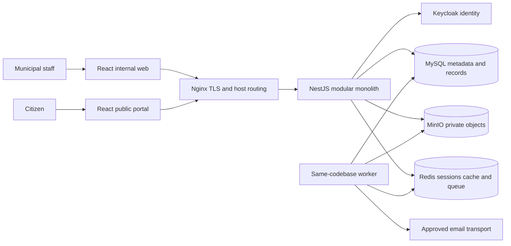
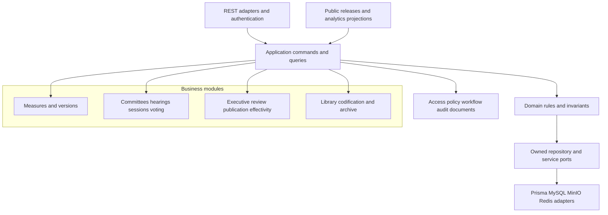

# 04 — System architecture

## Overall design

LTAS starts as one NestJS modular monolith, with one owned MySQL application database and distinct module interfaces. React + TypeScript clients use versioned REST. The public portal is a separate frontend, host and API route surface, not a second business backend. A worker may run the same backend image with a background-work entry point; this does not create independently owned microservices.

## Modular monolith

Modules own their tables and write operations. Other modules call application services or consume stable events. Read joins may be used inside documented read-model repositories with explicit ownership; arbitrary repository access from controllers is prohibited. Shared packages carry contracts and primitives, not an unbounded shared business layer. Domain rules avoid HTTP, Prisma and UI dependencies.

## Consistency and failure model

A consequential command validates identity, local account, permissions, record scope, expected revision and rule preconditions. It writes business state, an immutable event/timeline reference, required audit event and outbox message in one MySQL transaction. Use database unique constraints as the final arbiter of numbering and ballot uniqueness. Optimistic locking detects concurrent changes; short row locks protect sequence allocation and vote closing.

An outbox relay delivers notification, indexing, export and integration jobs at least once. Consumers maintain a unique event/consumer receipt and behave idempotently. Failed jobs have bounded retries, backoff and a dead-letter/review state. Do not promise exactly-once execution. Redis jobs are reconstructible from durable work/outbox records; no critical event lives only in Redis.

MinIO and MySQL do not share a distributed transaction. [Document management](10-DOCUMENT-MANAGEMENT.md) uses staged uploads, immutable object references and reconciliation. A file is unavailable to official use until validation/readiness is committed. Database success never asserts storage success without verified object evidence.

## Authentication choice

Use a NestJS backend-for-frontend session adapter inside the monolith. The browser follows Keycloak authorization-code login with PKCE via this adapter; access/refresh tokens stay server-side. A Secure, HttpOnly host-only session cookie identifies an application session in Redis. Cookie-authenticated mutations require CSRF protections. Non-browser integration tokens, if later enabled, follow a separate audience-validated bearer path. See [security](11-SECURITY-ARCHITECTURE.md). LTAS permissions and scope grants are authoritative in MySQL; Keycloak owns credentials and identity, avoiding two permission authorities.

## Public and search boundaries

Approved releases are immutable allowlisted snapshots with approved document derivatives. Public handlers read these through a restricted repository/database identity. They do not serialize internal case-file entities. A shared process is practical initially, but its public and internal route guards, query repositories and proxy rules are independently tested.

MVP uses structured MySQL filters plus optional Full-Text Search on eligible text. MySQL full-text indexing operates on supported textual columns; it does not itself extract PDF/DOCX or OCR images. Validate stopwords, token sizes and language behavior against the chosen version. [MySQL reference](https://dev.mysql.com/doc/refman/8.4/en/fulltext-search.html). Extraction is a background adapter; records with no extracted text remain discoverable by metadata. OpenSearch is deferred.

## Extension and extraction criteria

Integration envelopes carry event ID, schema version, municipality ID, entity ID, occurrence time and minimal payload; no complete private document is broadcast by default. External service credentials have distinct audiences and read/write scopes. New municipal modules must not share LTAS tables as an integration mechanism. Extract a module only after measured scaling, isolation or team-ownership needs justify extra operations, contract and consistency costs.

Related: [modules](05-MODULE-ARCHITECTURE.md), [deployment](16-DEPLOYMENT-ARCHITECTURE.md), [decisions](26-DECISIONS-AND-ASSUMPTIONS.md).
