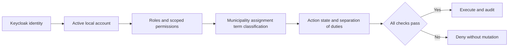

# 06 — User roles and permissions

Roles are grant bundles, not sufficient authority. Effective access is: authenticated active account + applicable permission + municipality/assignment/term scope + document classification + workflow preconditions + any required independent confirmation. Deny overrides allow. Historical office membership is retained after account access ends. Software access does not grant legal authority to sign, preside or vote.

## Proposed role bundles

SYS = System Administrator; PO = Vice Mayor / Presiding Officer; SEC = Secretary to the Sanggunian; COU = Councilor / Sanggunian Member; CH = Committee Chairperson; CM = Committee Member; CS = Committee Secretary/Staff; LS = Legislative Staff; RO = Records Officer; LR = Legal Reviewer; MAY = Mayor's Office Authorized User; MA = Municipal Administrator; AUD = Auditor/Read-Only Reviewer; PUB = Citizen. These proposed assignments need local validation ([D-03](26-DECISIONS-AND-ASSUMPTIONS.md)). The live Phase 1–2 subset (SYS, SEC, AUD, CS, LS) and the confirmation block are in [29](29-D-03-ROLE-BUNDLES.md).

| Role | Default scope and boundary |
|---|---|
| SYS | Identity operations, system settings and technical health; no default certify, vote, executive action or public release rights |
| PO | Designated sessions and presiding actions; ballot eligibility follows the approved profile, never this role alone |
| SEC | Secretariat case and session administration; designated record certification and release authority subject to separation rules |
| COU | Assigned/authorized measures and own voting eligibility during active office term |
| CH / CM | Respective committee matters while assigned; chair manages reports, members review and contribute |
| CS | Assigned committee recordkeeping; cannot certify committee approval solely by staff role |
| LS | Assigned draft preparation, filing support and evidence entry |
| RO | Custody, document classification, archive and approved release preparation |
| LR | Assigned legal review, rule review and documented legal assessments; no unilateral legislative approval |
| MAY | Assigned transmitted records and executive action entry backed by actual authority/evidence |
| MA | Approved operational reports and oversight, no automatic legislative mutation rights |
| AUD | Explicit read scope over records/audit; sensitive exports require a separate grant |
| PUB | Released public snapshots only, no internal account required |

## Permission matrix

Listed roles are proposed eligible bundles. Blank/unlisted roles are denied. `Own`, `assigned`, `designated` and `reviewed` remain mandatory policy predicates. A role may have fewer grants than shown when local duties require it.

| Permissions | Proposed roles | Additional restriction |
|---|---|---|
| measure.view | PO, SEC, COU, CH, CM, CS, LS, RO, LR, MAY, MA, AUD | Classification and assigned scope; MAY sees transmitted subset |
| measure.create, measure.edit | SEC, COU, CS, LS | Own/assigned draft or allowed editable metadata |
| measure.submit | SEC, COU, LS | Assigned draft, complete required fields |
| measure.file, measure.number.assign | SEC | Atomic numbering and acceptance authority |
| measure.transition, measure.withdraw | SEC | Named transition grant, evidence and approved profile |
| measure.certify | SEC | Designated certifier; exact version, no self-review where required |
| measure.version.create, amendment.record | SEC, COU, CS, LS | Allowed stage; cannot replace frozen version |
| reading.record | SEC, LS | Session authority; exact text and session reference |
| committee.manage, committee.members.manage | SEC | Approved organizational/membership authority |
| committee.referral.create, committee.referral.close | SEC | Recorded session/authorized referral decision |
| committee.meeting.manage, committee.report.edit | CH, CS | Assigned committee |
| committee.report.submit | CH | Evidence of committee action; staff entry may require chair confirmation |
| committee.report.review | CM, CH, SEC, LR | Assigned scope, no silent alteration of submitted report |
| hearing.manage, hearing.attendance.record | CH, CS, SEC, LS | Assigned hearing and minimal attendee data |
| hearing.submission.manage | CH, CS, LS | Classification controls and malware clearance |
| session.create, session.manage, agenda.manage | SEC | Session/agenda revisions, published items retained |
| session.preside, quorum.confirm | PO | Acting designation valid at session time |
| session.close, minutes.certify | SEC | Required presiding/secretariat confirmations per profile |
| attendance.record, attendance.correct | SEC, CS, LS | Session or assigned committee; correction reason retained |
| motion.record | SEC, LS | Actual proposer and occurrence time recorded |
| vote.manage, vote.record | SEC | Recording others' roll-call responses, never impersonating them |
| vote.cast | COU, PO, CH, CM | Own eligible seat; enabled only for approved voting mode |
| vote.view | PO, SEC, COU, CH, CM, RO, LR, AUD | Scope/classification; public sees released record only |
| vote.certify, vote.correct.request | SEC | Independent confirmation where required; frozen evidence |
| vote.correct.approve | PO | Designated authority distinct from correction requester |
| document.upload, document.version.create | SEC, COU, CS, LS, RO, LR, MAY | Parent record permission plus classification |
| document.view, document.download | All internal business roles except SYS by default | Explicit parent access and ready version |
| document.classify, document.redact | RO, SEC | Redaction produces derivative, never modifies original |
| document.certify | SEC, RO | Delegated certification authority, exact version/hash |
| mayor.action, mayor.receipt.record | MAY, SEC | Record actual actor/signatory; approval rights are delegated separately |
| mayor.override.record | SEC | Certified session decision and applicable legal basis |
| provincial_review.manage | SEC, LR | Actual correspondence, not invented provincial accounts |
| publication.manage, publication.evidence.record | SEC, RO, LS | Assigned posting/publication obligations |
| effectivity.confirm, legal_assessment.record | SEC, LR | Required legal/record authority combination per profile |
| library.view | Internal business roles | Scoped search including counts/snippets |
| codification.manage, relationship.confirm | LR, RO, SEC | Reviewer evidence; partial scope explicit |
| archive.manage, import.manage | RO, SEC | Reconciliation and provenance; no certification via import |
| retention.hold.manage, retention.disposition.request | RO, SEC | Named records authority; no ordinary deletion right; disposition requires separate approved procedure |
| implementation_review.manage | SEC, LR, MA | Assigned operational follow-up only |
| report.generate | PO, SEC, CH, RO, LR, MA, AUD | Dataset scope; separate sensitive export permission |
| report.export.sensitive | SEC, RO, AUD | Purpose/reason and individually approved grant |
| task.assign, task.manage | SEC, CH, CS, LS, RO | Scope and permitted assignees |
| notification.view, notification.preferences.manage | All authenticated users | Own notices/preferences; mandatory task visibility cannot be disabled |
| portal.release.prepare | RO, SEC | Approved allowlist and redacted derivatives |
| portal.release.approve, portal.release.publish | SEC | Named release authority; approver differs from preparer |
| portal.release.withdraw | SEC, RO | Reason; emergency removal recorded and reviewed |
| audit.view, audit.export | AUD, SEC | Approved purpose and field scope; export additional grant |
| user.manage, role.assign, permission.manage | SYS | Cannot grant self privileged business authority; grants audited |
| settings.manage, workflow.configure | SYS, SEC | Draft configuration only; cannot self-approve rule changes |
| workflow.approve | SEC, LR | Two named reviewers and recorded organizational authority |
| backup.operate, system.monitor | SYS | No ordinary business data export rights implied |
| public.view, public.download | PUB | Approved active release only |

## Grant and revocation policy

Use `user_roles` with scope and effective dates; exceptional individual permissions belong to separately reviewed, time-limited `user_permission_grants`. Local account disabled state and policy version are checked on each request. Cache grants briefly with explicit invalidation; revocation must take effect on the next protected request, not wait for a long-lived identity token. Stale/unknown policy denies consequential writes.

Privileged grants, rule approval, public release, corrections and break-glass access require reason and named approver distinct from the requester. Where staffing cannot support separation, the municipality must approve a documented alternate review; the system must not silently bypass the control. No wildcard administrator bypass for legal actions. Technical emergency access is time-limited, logged outside the host, reviewed, and cannot change certified evidence through normal APIs.

Tests must cover combined roles, expired assignments, acting officers, cross-committee access, account disablement, guessed IDs, redacted fields, exports and files. See [security](11-SECURITY-ARCHITECTURE.md) and [testing](18-TESTING-STRATEGY.md).
