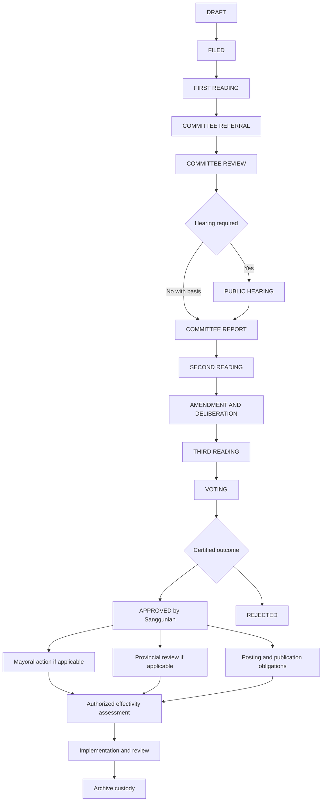
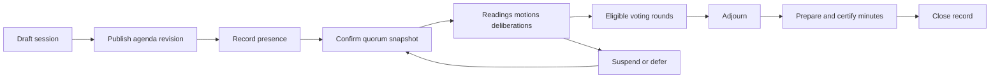
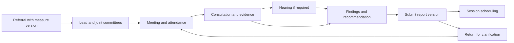
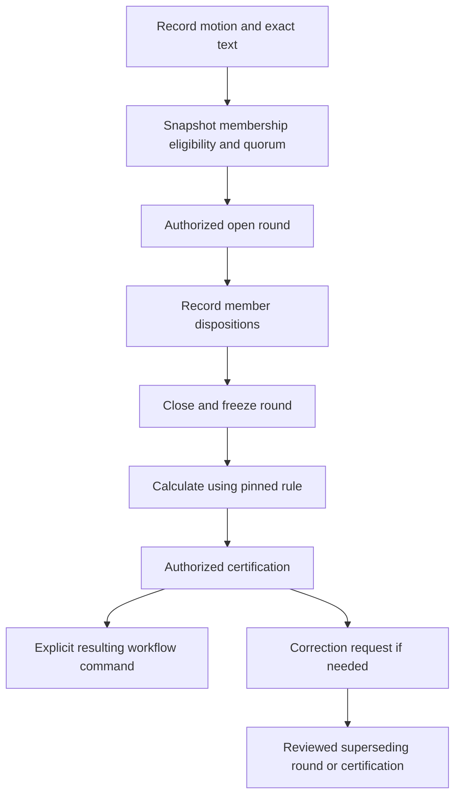
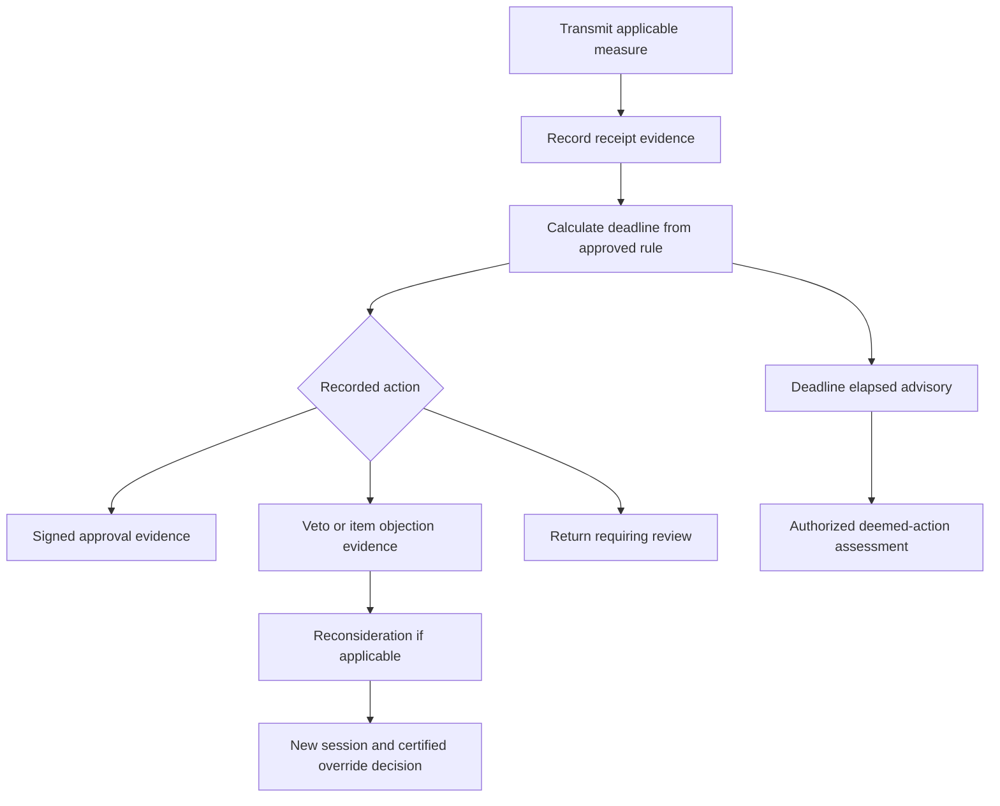
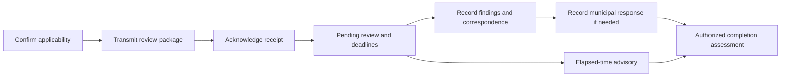

# 07 — Legislative workflow and rules

The lifecycle below is a planning template, not a universal legal procedure. Approved municipal Internal Rules of Procedure and reviewed measure-type profiles determine which readings, referrals, hearings, thresholds and post-approval actions apply. Sources and local validation tasks are in [25](25-SOURCES-AND-RULE-VALIDATION.md). The software records authorized conclusions; it does not declare legal validity.

## State dimensions

`legislative_stage` describes proceedings: DRAFT, FILED, FIRST_READING, COMMITTEE_REFERRAL, COMMITTEE_REVIEW, PUBLIC_HEARING, COMMITTEE_REPORT, SECOND_READING, AMENDMENT_DELIBERATION, THIRD_READING, VOTING, APPROVED, REJECTED, WITHDRAWN, DEFERRED. These are conceptual codes. Measure status catalogs map display labels to stable semantics. Returns and reconsideration are explicit events/branches, not destructive resets.

Separate executive, provincial-review, publication, effectivity and archive states remain visible concurrently. APPROVED means the recorded Sanggunian decision, not necessarily signed, effective, reviewed, published or publicly released. IMPLEMENTATION_REVIEW is an activity dimension. ARCHIVED describes custody, not legal status. Legal assessments are separately recorded as active, amended, repealed, superseded, obsolete or under review.

Post-approval arrows show tracked obligations, not a claim that every branch is a universal prerequisite or strictly sequential. Profiles specify dependencies, trigger events and non-applicability evidence. Archive can accept incomplete historical records marked as such.

## Rule taxonomy

| Rule class | Treatment | Examples |
|---|---|---|
| System-enforced invariant | Cannot be configured away | Authorization, immutable certified versions, unique number/seat, atomic audit, version binding |
| Configurable approved procedure | Versioned profile with authority and effective interval | Measure path, required readings, notice/evidence lists, voting denominator/threshold, deadline calendar and trigger |
| Advisory | Calculation or warning requiring a visible basis | Candidate quorum, impending deadline, suspected duplicate, candidate effectivity |
| Authorized human confirmation | Named officer, evidence, reason and policy version | Quorum declaration, certified result, applicability, deemed action, effectivity, legal condition |

Configurable does not mean legally optional. Potentially statutory rules are entered only from a legally reviewed profile. Profiles cannot bypass technical integrity or allow an unprivileged user to supply arbitrary target states. No executable scripts, SQL or general-purpose rules language in MVP; use an allowlisted condition/action catalog.

## Profile and transition contract

A profile version records municipality, measure type/subtype, scope, source authority, effective dates, approval actors, state graph, conditions, required evidence, permitted commands, deadline definitions, voting/quorum formulas and exception categories. Draft → reviewed → approved → retired; approved versions are immutable. Pin each workflow instance to a version. Migrating an in-flight case requires an impact preview, legal/secretariat approval, old/new versions and explicit mapping event. Never retroactively recalculate closed votes under new rules.

Every command supplies expected record revision, intended transition, occurrence date/time, evidence IDs and reason when required. The server resolves the profile and authority; validates evidence/readiness; obtains needed locks; writes state/history/audit/outbox atomically. Rejected attempts do not advance state. A separate security event may record abuse without sensitive payloads.

| Transition family | Minimum guards | Recorded evidence |
|---|---|---|
| Draft → filed | Submitter authority, required metadata, stable text, number allocation | Filing acknowledgment and exact version |
| Reading → referral/report | Session event and approved procedural path | Reading record, referral recipient(s), due rule |
| Committee → report | Assigned committee, required hearings or non-applicability basis | Findings, recommendations, submitted report version |
| Deliberation → next reading/vote | Required prior steps and considered version identified | Amendments, motion, session reference |
| Voting → approved/rejected | Closed round and authorized certification | Membership/quorum snapshots, member dispositions, tally and result |
| Approved → executive/review obligations | Applicability decided and transmission evidence | Dispatch, receipt, accountable office, calculated deadlines |
| Evidence → effectivity confirmation | Applicable requirements reviewed; disputed/missing evidence resolved or explicitly assessed | Clause, proofs, reviewed date and confirming authority |
| Any allowed stage → deferred/withdrawn/returned | Profile allows it and authority provides reason | Prior stage retained, resumption path and outstanding obligations |

## Session and committee workflows

A session may adjourn without any vote. Closed minutes corrections create a superseding certification. Arrival/departure events prompt a new quorum assessment before the next consequential business event; prior snapshots remain unchanged.

Joint referrals retain each committee's response, due date and dissent where recorded. A lead report does not erase a minority or separate report. Hearings may relate to multiple measures through explicit links.

## Voting workflow

Default MVP is secretary-entered roll-call evidence, not legally binding remote voting. `vote.cast` is reserved for a locally approved self-cast mode; disabled until voting mode is approved. Store actual voting member, recording operator, timestamp and source. Yes, No and Abstain are choices. Absent and Inhibited are attendance/eligibility dispositions, not cast ballots; missing response is PENDING/NOT_RECORDED, never automatically “No.” Presiding officer/tie treatment, vacancies, ex officio members, inhibition and threshold denominators require explicit approved formulas. Save numerator, denominator, rounding method and eligible roster. Concurrent close/cast is serialized; late submissions receive conflict. A correction cannot edit the original certified record.

## Mayoral action

Track item-level objections separately when applicable. Preserve dispatch and receipt as distinct facts, signatory versus recording user, signed pages, correspondence and objection scope. A returned record is not automatically a veto. Timer expiry creates a task, never an automatic approval. Override threshold and eligibility come from the reviewed applicable rule, not a generic simple majority.

## Provincial review

Not every resolution automatically enters review. Non-applicability is an evidence-backed determination. Separate transmission deadline from review deadline and any response task. Provincial findings and a municipal interpretation remain different records. Review outcome does not automatically change every other lifecycle dimension.

## Deadline calculations and exceptional cases

Each deadline keeps trigger type/ID, proven occurrence date, timezone, rule version, duration/unit, inclusive/exclusive counting, weekend/holiday handling, calendar version, due date, calculation explanation, superseded calculation ID and confirmation. Store date-only legal dates as dates, not guessed midnight instants. A scheduler's “overdue” flag has no autonomous legal consequence. Missing/contested receipt evidence yields an unresolved calculation task. Calendar or trigger corrections create a new calculation; original values remain auditable. Re-run queued reminders against current deadline revision.

Exceptions: urgent procedure, bypassed step, reconsideration, withdrawn measure, re-referral, split/joint committee treatment, re-filing, historical import and judicial/administrative intervention must have approved categories. Technical administrators cannot create an arbitrary “force approved” command. Record the basis, authority, affected scope and next required actions. Re-filed matters receive a new case ID with relationship to the original unless approved procedure explicitly preserves identity.

Related: [permission model](06-USER-ROLES-AND-PERMISSIONS.md), [audit](12-AUDIT-TRAIL-DESIGN.md), [tests](18-TESTING-STRATEGY.md).
