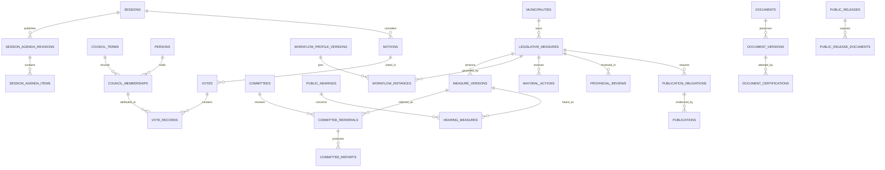

# 08 — Conceptual database design

This is a conceptual relational model for **MySQL through Prisma**, not SQL, Prisma schema or migrations. Entity names establish vocabulary for future implementation. Fields shown are important fields, not a final physical column/type specification. Physical sizing, engine version and generated/functional-index support require Phase 1 compatibility validation.

## Shared conventions

All owned entities have an opaque stable `id`; municipality-scoped entities include `municipality_id`. Mutable rows include `created_at`, `created_by`, `updated_at`, `updated_by`, and `revision`. Events distinguish `occurred_at` (or an explicitly date-only occurrence) and `recorded_at`; uncertain historical dates carry precision/source flags. Use UTC for instants and Asia/Manila when displaying/performing approved calendar calculations. Text uses a reviewed utf8mb4 collation; normalized searchable codes and official numbers use consistent case/collation rules. No floating-point fractions for vote thresholds.

`U(...)` below denotes a unique key; `I(...)` a query index. Every foreign key is indexed where useful and references the stated parent. Include municipality in composite references/validation to prevent cross-municipality links even though the initial deployment hosts one municipality. Use restricted deletion for authoritative relationships, never cascading deletion of legislative evidence. Official numbers are distinct from technical IDs, allocated atomically using a number sequence; immutable once issued except a separately recorded correction. Null official numbers on drafts are allowed. Sequence gaps are acceptable with audit; numbers are never reused.

Audit/retention codes in every table:

- **M**: mutable administration/draft data; audit creation, field changes, deactivation and restoration. Soft deletion/deactivation only when unreferenced or operationally allowed; retain attribution and references.
- **H**: historical/official evidence; append and never ordinarily delete or overwrite. Audit creation/certification/supersession. Corrections add linked successors; official-event content remains immutable.
- **L**: lifecycle row; draft edits audited, then freeze on submission/closure/certification with append-only revisions afterward. Soft deletion only for unused drafts; filed/used records never ordinarily deleted.
- **O**: operational data; audit state/action transitions as relevant. Approved retention may purge payloads after dependencies and holds clear; retain official evidence elsewhere.

“Never delete” means no ordinary application deletion of authoritative history. Any legally required exceptional disposition requires separately approved records/privacy process, legal-hold checks, restricted operator, evidence manifest and retained disposition audit; it is not a generic delete endpoint. Backup expiry is separately governed. No record schedule is invented here.

## Identity and configuration

| Entity / purpose | Important fields and relationships | Indexes and uniqueness | Audit / retention |
|---|---|---|---|
| municipalities — installation identity | name, province, official code, branding references, timezone | U(official_code); I(name) | M; deactivate only |
| users — local access identity | municipality, Keycloak issuer + subject, display name, enabled, policy_version; no password | U(issuer, subject); I(municipality, enabled) | M; disable, preserve actor ID |
| roles — permission bundles | municipality, code, label, protected flag | U(municipality, code) | M; retire referenced role |
| permissions — action catalog | code, description, risk class | U(code) | M; stable code, retire |
| user_roles — scoped assignments | user → users, role → roles, scope_type/id, effective_from/to, approver | U(user, role, scope_key, effective_from); I(user, effective_to) | H grant/revoke events; interval updates through new revision |
| role_permissions — bundle membership | role, permission, grant/revoke revision, active flag | U(role, permission, revision); I(role, active) | H revisions retained |
| user_permission_grants — approved exceptions | user, permission, allow/deny, scope, interval, approver, reason | U(user, permission, scope_key, effective_from); I(user, effective_to) | H; revocation event |
| council_terms — term context | municipality, label, start_date, end_date | U(municipality, label); I(start_date, end_date) | M; freeze referenced dates via reviewed correction |
| persons — historical people independent of login | public name, minimal private contact fields, linked_user nullable | I(municipality, normalized_name); no unique name | M; referenced name history retained |
| council_memberships — office/seat history | person, council_term, seat_code, office_type, effective interval, authority evidence | U(term, seat_code, effective_from); I(person, interval) | H; prevent overlapping active seat intervals in transaction |
| system_settings — versioned nonsecret configuration | municipality, key, version, validated value, approval, effective dates | U(municipality, key, version); I(key, effective_from) | H approved versions; no secrets |
| number_sequences — official numbering | municipality, series, type, year/term scope, next_value | U(municipality, series, scope_key) | M; every allocation audited; row lock |
| calendars — deadline calendars | municipality, version, timezone, approved_by | U(municipality, version) | H approved versions |
| calendar_days — exceptions/holidays | calendar, date, treatment, authority/source | U(calendar, date); I(date) | H once approved |

## Measures and rules

| Entity / purpose | Important fields and relationships | Indexes and uniqueness | Audit / retention |
|---|---|---|---|
| measure_types — ordinance/resolution/other catalog | municipality, code, label, default profile reference | U(municipality, code) | M; retire |
| measure_statuses — stage catalog | code, dimension, label, stable semantic mapping | U(dimension, code) | M; referenced semantic mapping immutable |
| legislative_categories — policy taxonomy | municipality, code, parent category, label | U(municipality, code); I(parent) | M; retire referenced categories |
| legislative_measures — case root | type, term, draft reference, official series/number/year, title, subject, filing_date, legislative_stage, current_version, classification, revision | U(municipality, series, year_or_term, number); I(municipality, stage, filing_date, id); I(type, year); FULLTEXT(title, subject) candidate | L; filed identity never deleted |
| measure_categories — classification assignments | measure, category, assigned_by | U(measure, category); I(category, measure) | M draft; H changes once filed |
| measure_authors — authors/co-authors/sponsors | measure, person, membership nullable, contribution_role, ordering, attribution snapshot | U(measure, person, contribution_role); I(person, role) | L; historical attribution corrections retained |
| measure_versions — legislative text identity | measure, sequence, parent_version, stage_label, primary_document_version, text synopsis, frozen_at | U(measure, sequence); I(measure, stage_label) | H from creation; draft editing produces new saved text versions |
| measure_status_history — chronological transition evidence | measure, prior/new dimension/state, workflow_instance, profile_version, actor, evidence, reason, previous_revision | U(measure, transition_sequence); I(measure, occurred_at, id); I(recorded_at) | H |
| measure_readings — considered text at proceeding | measure_version, session, agenda_item, reading_kind, occurrence, outcome, supersedes | I(measure_version, reading_kind); U(session, agenda_item, event_sequence) | H; repeats allowed with distinct event IDs |
| amendments — proposals and disposition | measure, source_version, proposed_version, motion, scope/section, proposer, outcome, adopted_version | I(measure, occurred_at); I(motion); no unique textual amendment | L proposed, H upon consideration |
| measure_relationships — directed legislation relationships | source_measure, target_measure, relation_type, source_version, target scope, evidence, effective interval, reviewer | I(source, type); I(target, type); U(source, target, type, scope_key, assessment_revision) | H; self-links prohibited where nonsensical |
| legal_status_assessments — reviewed legal condition | measure, condition, section scope, effective interval, basis_document_version, reviewer, supersedes | I(measure, effective_from); U(measure, assessment_sequence) | H; no auto repeal from graph |
| workflow_profiles — profile identity | municipality, measure_type, code, description | U(municipality, code) | M; retire |
| workflow_profile_versions — immutable approved definition | profile, version, state, authority, approvers, effective interval, condition catalog, approval_time | U(profile, version); I(profile, effective_from) | L draft then H |
| workflow_transitions — allowed edges | profile_version, transition_code, from/to dimensions, permissions, evidence requirements, condition IDs | U(profile_version, transition_code); I(profile_version, from_state) | H with approved profile |
| workflow_instances — case profile binding | measure, profile_version, active flags, revision, prior binding | I(measure, active); one active binding enforced transactionally | L binding revisions are H |
| deadline_rules — approved calculation definitions | profile_version, code, trigger, duration/unit, inclusivity, calendar policy, authority | U(profile_version, code) | H |
| deadlines — versioned calculations | measure/obligation link, rule, trigger evidence, timezone, calendar_version, due date/time, explanation, supersedes, confirmed_by | U(obligation_key, calculation_revision); I(municipality, due_at, status) | H calculations; status events separate |
| deadline_events — fulfillment and review history | deadline, event_type, actor, occurrence, evidence, supersedes | U(deadline, sequence); I(deadline, occurred_at) | H; closing a reminder alone cannot fulfill obligation |
| implementation_reviews — follow-up observations | measure, responsible office, review_date, task, findings, evidence | I(measure, review_date); I(responsible_office, due_date) | L then H on submission |

Use structured relational fields for common filters and evidence references. A constrained JSON field may store an approved condition definition or immutable calculation inputs, but not arbitrary executable rules or the entire legislative case. Logical polymorphic obligation links require explicit allowed owner types and service-level referential checks; prefer concrete foreign keys for frequent paths.

## Committees and hearings

| Entity / purpose | Important fields and relationships | Indexes and uniqueness | Audit / retention |
|---|---|---|---|
| committees — standing/special committee identity | municipality, term, code, name, type, mandate, active interval | U(municipality, term, code); I(term, type) | M; retain historical committee |
| committee_members — assignments | committee, person/membership, chair/vice/member/staff role, interval, appointment evidence | U(committee, person, role, effective_from); I(committee, effective_to) | H; overlap rules transactionally checked |
| committee_referrals — per-committee obligation | measure_version, committee, lead/joint role, source session/event, referred_date, deadline, disposition | U(measure, committee, referral_sequence); I(committee, disposition, due_date) | L then H events |
| committee_meetings — meeting occurrence | committee, reference, date/time, venue, state, minutes version | U(committee, reference); I(committee, scheduled_at) | L; closed records frozen |
| meeting_referrals — considered referrals | meeting, referral, sequence, measure_version | U(meeting, referral, sequence); I(referral) | H once considered |
| committee_attendance — per-person meeting record | meeting, person, attendance disposition, evidence | U(meeting, person); I(person, meeting) | L draft; H frozen plus corrections |
| meeting_participants — resource persons and guests | meeting, optional person, public display name, organization, participant_role, restricted contact fields | U(meeting, participant_reference); I(meeting, participant_role) | L then H; private fields subject to approved retention |
| meeting_documents — position papers and supporting evidence | meeting, document_version, participant nullable, evidence_kind, received_at | U(meeting, document_version, evidence_kind); I(meeting, evidence_kind) | H; exact submitted versions retained |
| committee_reports — findings/recommendation revisions | referral, meeting nullable, report_no, revision, findings, recommendation, report_document_version, submitted_by | U(referral, report_no, revision); I(referral, submitted_at) | L then H |
| public_hearings — hearing event | organizing committee, schedule, venue, state, notice_date, findings, minutes version | I(municipality, scheduled_at); no unique schedule | L then H |
| hearing_measures — hearing/case links | hearing, measure_version, purpose | U(hearing, measure_version); I(measure_version) | H after notice |
| hearing_notices — notice evidence | hearing, channel/location, issued_at, document_version, proof | I(hearing, issued_at); U(hearing, notice_sequence) | H |
| hearing_attendees — attendance and resource persons | hearing, optional person, display name, organization, barangay, resource_person flag, minimal restricted contacts, attendance | I(hearing, name); U(hearing, attendee_reference); names not unique | L; disclosure and retention reviewed |
| hearing_documents — submissions and evidence | hearing, document_version, submitter/attendee nullable, kind, received_at, classification | U(hearing, document_version, kind); I(hearing, kind) | H |

## Sessions and voting

| Entity / purpose | Important fields and relationships | Indexes and uniqueness | Audit / retention |
|---|---|---|---|
| sessions — regular/special proceedings | municipality, term, series/number, type, schedule, venue, presiding_membership, state, adjourned_at, certified_minutes_version | U(municipality, term, series, number); I(scheduled_at, state) | L; closure freezes record |
| session_agenda_revisions — published agenda editions | session, revision, published_at/by, supersedes | U(session, revision) | L then H |
| session_agenda_items — order of business | agenda_revision, sequence, business_category, measure_version nullable, reading_kind, disposition | U(agenda_revision, sequence); I(measure_version) | H after publication; new revision for change |
| session_attendance — roster summary | session, membership, current disposition, source; references events | U(session, membership); I(membership, session) | L; official snapshots immutable |
| attendance_events — arrivals/departures/corrections | session_attendance or committee_attendance, type, occurred_at, recorded_by, reason, supersedes | I(attendance_owner, occurred_at); U(owner, sequence) | H |
| quorum_snapshots — declared eligibility/presence | session or meeting, rule_version, roster snapshot, eligible_total, present_total, computed result, declared result, confirmer, evidence | U(proceeding_key, sequence); I(session, occurred_at) | H; no edits from later attendance |
| motions — proposal acted on | session, agenda_item, proposer_membership, seconder nullable, text/version, type, disposition | I(session, occurred_at); U(session, motion_sequence) | L then H when considered |
| deliberation_entries — proceedings notes | session, agenda_item, speaker nullable, occurrence, summary, document_version, correction_of | I(session, occurred_at); U(session, entry_sequence) | H official entries |
| votes — a voting round | motion, measure_version nullable, round_number, mode, rule_version, quorum_snapshot, eligibility snapshot, open/close times, state, tally inputs/result, supersedes | U(motion, round_number); I(session_ref, state) | L open; H closed; session_ref derived/validated |
| vote_records — one member disposition per round | vote, membership, choice/disposition, actual actor, recorder, source, recorded_at | U(vote, membership); I(membership, vote) | L while open with audit; H closed |
| vote_certifications — certified result evidence | vote, certifier, confirmation authority, tally hash, document_version, supersedes | U(vote, certification_sequence); I(certifier, recorded_at) | H |
| correction_requests — official correction workflow | owner type/id, requested_by, proposed correction, reason, evidence, reviewed_by, outcome, replacement_ref | I(owner, state); U(owner, request_sequence) | L request then H resolution; typed-owner validation |

Closed rounds hold a complete roster snapshot, including absent/inhibited/pending classifications. Uniqueness protects against double entry; authorization protects against voting for another seat. Snapshots may use child rows rather than JSON at physical design time if filtering or explicit foreign keys are needed. No certification without a reproducible denominator.

## Post-approval, files and archives

| Entity / purpose | Important fields and relationships | Indexes and uniqueness | Audit / retention |
|---|---|---|---|
| mayoral_actions — dispatch/receipt/action events | measure, sequence, action_type, scope/item references, dispatched/received/action dates as applicable, signatory, recording user, objections, evidence_version, deadline | U(measure, sequence); I(measure, action_type, occurred_at) | H; receipt corrections append |
| provincial_reviews — review case | measure, review_sequence, receiving office, applicability basis, status, transmission/receipt refs, deadlines, completion assessment | U(measure, review_sequence); I(status, due_date) | L summary; evidence events H |
| provincial_review_events — correspondence/findings | review, kind, occurrence, office, findings, action, document_version, supersedes | U(review, sequence); I(review, occurred_at) | H |
| publication_obligations — required posting/publication | measure, requirement kind, rule, location/provider requirement, scope, due rule, completion assessment | U(measure, obligation_sequence); I(state, due_date) | L assessment; revisions H |
| publications — fulfillment evidence | obligation, posting location/provider, start/end dates, publication_date, proof_document_version, recorder, remarks | U(obligation, evidence_sequence); I(obligation, publication_date) | H; multiple locations/evidence allowed |
| effectivity_confirmations — candidate/confirmed dates | measure, candidate_date, confirmed_date, legal basis, authority, evidence manifest, supersedes | U(measure, confirmation_sequence); I(confirmed_date) | H; no automated legal determination |
| documents — logical document identity | municipality, title, kind, classification, owning module/record, current_ready_version, retention_class | I(owner_type, owner_id); I(classification, created_at) | L metadata; retain referenced identity |
| document_versions — immutable object manifest | document, sequence, bucket, object_key, storage_version_id, SHA-256, bytes, detected MIME, original filename, uploaded_by, validation_state, scan verdict, parent/derivative_of | U(document, sequence); U(bucket, object_key); I(hash); hash NOT unique globally | H bytes and manifest; readiness transitions audited |
| document_links — reusable authorized associations | document_version, owner type/id, purpose, scope | U(document_version, owner_type, owner_id, purpose); I(owner_type, owner_id) | H for official links; validate typed owner existence |
| document_certifications — attestation | document_version, certifier, authority, attestation, certified_at, supersedes | U(document_version, certification_sequence); I(certifier, certified_at) | H |
| upload_sessions — staged upload tracking | uploader, proposed owner, quarantine key, expiry, expected bytes, status | U(quarantine_key); I(status, expires_at) | O; orphan cleanup policy |
| document_extractions — optional search text | document_version, extractor/version, text, quality flag, extracted_at | U(document_version, extractor, extractor_version); FULLTEXT(text) candidate | O derivative; never certified source |
| archive_accessions — case-file custody | measure, accession_no, custodian, date, completeness, inventory_document_version, source provenance | U(municipality, accession_no); I(measure, date) | H |
| retention_holds — preservation blocks | owner type/id, reason, authority, opened_at, release evidence | I(owner, active); U(owner, hold_sequence) | H; release event |
| import_batches — migration provenance | source inventory, operator, mapping version, started/completed, reconciliation counts, approval | U(municipality, batch_reference); I(state) | L then H |
| import_items — staged and reconciled source rows | batch, source_key, source hash, target measure/document, validation errors, disposition | U(batch, source_key); I(batch, disposition) | L staged; H reconciliation |

## Publication and operational support

| Entity / purpose | Important fields and relationships | Indexes and uniqueness | Audit / retention |
|---|---|---|---|
| public_releases — reviewed public snapshot | source type/id/revision, release sequence, allowlisted payload, classification review, preparer, approver, status, published/withdrawn times | U(source_type, source_id, release_sequence); I(status, published_at); FULLTEXT(approved_title, approved_text) candidate | L draft; H approved payload and release events |
| public_release_documents — approved file derivatives | release, document_version, public label, derivative hash | U(release, document_version); I(release) | H; original not implicitly exposed |
| tasks — assigned operational work | municipality, owner reference, assignee, due deadline reference, state, completion evidence, revision | I(assignee, state, due_at); I(owner_type, owner_id) | L completion history retained |
| notifications — logical notice | user, event, template_version, owner reference, safe summary, read_at | U(user, event, template_version); I(user, read_at, created_at) | O; legislative events retained separately |
| notification_deliveries — channel attempts | notification, channel, attempt, dedupe key, sent_at, result, provider reference | U(notification, channel, attempt); I(state, next_attempt_at) | O; delivery retention TBD |
| notification_preferences — user channels | user, notice category, email enabled, locale | U(user, category) | M; mandatory tasks remain visible |
| report_jobs — export reproducibility | requester, report_definition_version, filters, as_of, permission scope, state, output_document_version, expiry | I(requester, created_at); I(state, expires_at) | O; sensitive export actions audited |
| audit_logs — authoritative audit event | actor identity snapshot, action, entity type/id, old/new safe diff, correlation, reason, occurrence/recording timestamps, origin metadata, sequence/hash | U(municipality, audit_sequence); I(entity_type, entity_id, recorded_at); I(actor, recorded_at) | H; append-only DB grant |
| audit_exports — independent evidence manifest | interval, last sequence, digest, destination reference, verifier, verification result | U(municipality, export_sequence); I(exported_at) | H; off-host copy |
| outbox_events — durable async intent | event_id, aggregate ID/revision, type, schema_version, minimal payload, created_at, delivery state | U(event_id); I(state, created_at) | O delivery state; retain as required for replay |
| consumer_receipts — duplicate processing guard | consumer, event_id, completed_at, result reference | U(consumer, event_id) | O; retain at least through replay window |
| idempotency_records — safe command retry | actor, route/action, key, request_hash, state, result reference, expires_at | U(actor, action, key); I(expires_at) | O; expiration cannot bypass domain uniqueness |

## Domain relationships

## Integrity and physical-design decisions

MySQL has no general exclusion constraint for arbitrary overlapping effective-date intervals. Membership, grant and profile overlap checks therefore require locked transactional validation and concurrency tests. Do not rely on nullable composite unique keys to enforce “one current row”; use a locked owner pointer or approved physical pattern. Positive temporal intervals, valid typed owner references, same-municipality associations and acyclic version ancestry are checked at domain boundary, with database constraints where supported.

The final physical design must specify string lengths, ID representation, decimal/rational types, timezone handling, JSON validation, secondary-index cost, full-text limits and migration/backfill strategy. Query plans drive indexes; do not index every field. Keycloak has a separate database/schema and service account, with its vendor-managed schema outside Prisma ownership. Redis contains no sole copy of authoritative legislative history.

Related: [architecture](04-SYSTEM-ARCHITECTURE.md), [documents](10-DOCUMENT-MANAGEMENT.md), [audit](12-AUDIT-TRAIL-DESIGN.md), [traceability](27-TRACEABILITY-MATRIX.md).
