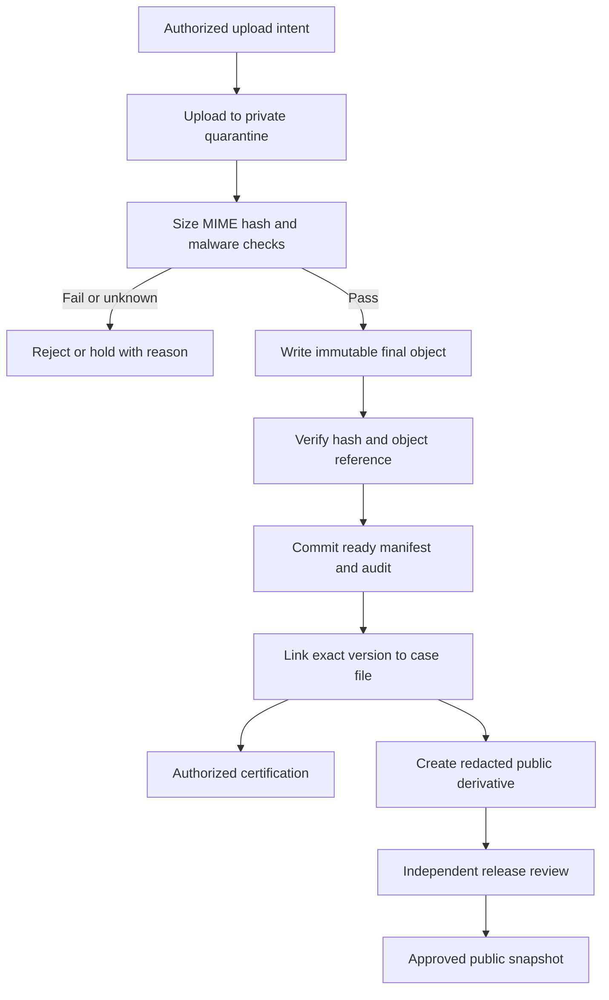

# 10 — Document management

MySQL owns metadata, classification, provenance, immutable version manifests and certifications. **MinIO stores actual files.** A document is a logical item; a document version is a particular byte sequence. A measure version identifies legislative text at a procedural stage and references one or more document versions. These identities must not be conflated.

## Storage and validation

Use private buckets separated by purpose: quarantine, authoritative versions and approved public derivatives. Bucket names are environment configuration. Object keys follow a nonsemantic pattern such as `municipalities/{municipalityId}/documents/{documentId}/versions/{versionId}/{randomObjectId}`. Do not put names, measure titles, contacts or user-supplied paths into keys. Preserve the original filename only as sanitized metadata; generate a safe download filename from approved reference/type/version. File extension never proves content type.

Proposed initial allowlist: PDF, DOCX, JPEG, PNG and TIFF. Confirm TIFF/browser preview support before release; previews are derived artifacts. Reject executables, macro-enabled documents, active HTML/SVG and encrypted/uninspectable uploads unless a reviewed exceptional process exists. Suggested initial per-file cap is 25 MiB, with a separately approved large-scan procedure; final size, per-user quota and total case quota are TBD after document sampling. Apply limits at proxy, API, streaming upload and decompressed document inspection boundaries.

Validate authorization to the intended parent before upload. Stream to quarantine, inspect byte signatures and parser results, compare extension/MIME, enforce size and decompression limits, calculate SHA-256 server-side, and record scanner/extractor version and result. Hashes provide integrity evidence, not proof of authorship or legal authenticity. Do not return cross-user duplicate-hash information.

The malware scanner is an adapter extension point, with provider/version TBD. Production release of uploads requires a functioning approved scan path. Scanner outage/unknown verdict remains quarantined; no administrator “skip scan” toggle for routine publishing. A separately approved manual intake procedure may record documents outside the online release path while review is pending. Sandbox converters/extractors with no arbitrary network access and strict resource limits.

## Consistency protocol

1. Persist an upload session with owner, expected limits, expiry and unique quarantine key.
2. Accept bytes only for that intent; finalize using an idempotency key. A missing/partial upload cannot become READY.
3. Validate/scan in background. Copy a passing object to a new immutable final key; verify existence, size and hash.
4. Commit the version manifest, ready state, link, audit and outbox in MySQL. On database failure the object remains an unreferenced candidate, not a published document.
5. Reconciliation compares upload sessions, committed manifests and objects. Delete expired quarantine/orphan candidates only after grace period, retry review and hold/reference checks. Never garbage-collect a referenced official object merely because a job failed.

MinIO versioning is defense in depth, not a substitute for explicit document_versions. Never overwrite or reuse a final key. If approved object lock/WORM is available in the selected edition/configuration, validate retention and restore implications before enabling it; support/licensing is D-12. The application storage identity must not delete protected official versions. Infrastructure administrators remain a residual risk addressed by independent backups and audit evidence.

## Classification and download

Suggested classes: RESTRICTED, INTERNAL, PUBLIC_CANDIDATE and APPROVED_PUBLIC_COPY. The latter is a property of an approved release/derivative, not permission to expose the entire source document. A file can be more restricted than its case, never less restricted by an implicit link. Check document plus every relevant parent constraint; a second permissive link cannot bypass an existing restriction without explicit release review.

Use authenticated download mediation for internal files. If presigned links are later chosen, keep them short-lived, scoped to one version, never logged, and document that they remain usable until expiry; high-sensitivity material should use a rechecking proxy. MVP public downloads use mediated approved release links, allowing immediate server-side withdrawal. Use attachment disposition and safe MIME/security headers; isolate previews from privileged application origin where needed.

Certification stores exact version ID, hash, named certifier, authority, time, attestation and supporting evidence. Scanned signatures are evidence, not cryptographic digital signatures. Signing, electronic certification and legally recognized digital signatures are separate policy decisions. A corrected certified copy receives a new version and superseding certification; the original remains retrievable internally.

## Search, comparison and preservation

Extraction/OCR outputs are derivatives with tool version, quality flag and source hash. They never substitute for the signed original. Metadata search remains supported without extraction. Text comparison is future; it must identify both immutable versions and label OCR uncertainty. Public derivatives must strip hidden metadata, comments, revision history, invisible text and embedded attachments as applicable; reviewers verify rendered and extractable content.

Retention, holds and disposition follow [database rules](08-DATABASE-DESIGN.md) and [recovery](17-BACKUP-AND-DISASTER-RECOVERY.md). Verify hashes during migration, restore and periodic sampling. Requirements: LTAS-FR-DOCUMENT-001/002 and LTAS-FR-VERSION-001.
