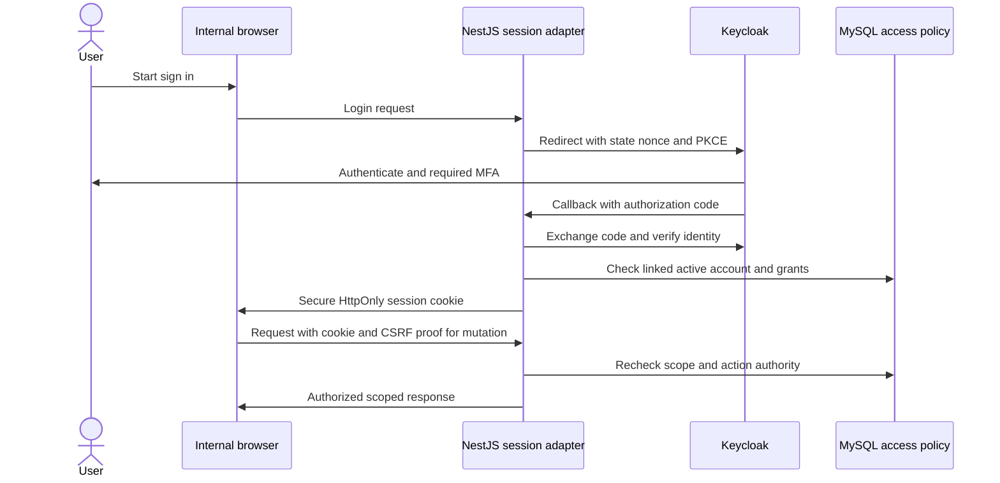

# 11 — Security architecture

Security requirements support municipal governance and data protection; they do not prove legal compliance. The municipality must establish lawful processing, responsibilities, notices, records/disclosure decisions and incident procedures with its privacy and legal officers. The [Data Privacy Act](https://privacy.gov.ph/data-privacy-act/) and NPC Circular 2023-06 are starting references. The NPC confirms that 2023-06 repealed Circular 16-01 and took effect on March 30, 2024; do not use 16-01 as the current baseline. [NPC announcement](https://privacy.gov.ph/npc-issues-circulars-to-strengthen-personal-data-protection-in-ph/). Current applicable issuances must be checked during policy approval.

## Identity and session design

Keycloak owns credentials, MFA, identity lifecycle and SSO. LTAS links a local account using issuer + subject, never mutable email alone. Credentials are never copied into the application database. Separate clients/audiences for each future municipal application prevent LTAS sessions or roles from granting unrelated access. Keycloak administration is restricted to an administrative network and separately privileged operators.

The selected browser model is an internal NestJS session adapter (BFF). Authorization Code with PKCE exchanges credentials only through Keycloak; use discovery endpoints, exact redirect URIs, state and nonce validation. Tokens remain server-side; browser local/session storage contains no access or refresh token. This uses Keycloak's documented OIDC capabilities; exact library/version compatibility must be verified. [Keycloak OIDC documentation](https://www.keycloak.org/securing-apps/oidc-layers).

Use host-only Secure HttpOnly cookies, suitable SameSite policy and session rotation at login/privilege change. Proposed initial settings: 30-minute idle timeout and 8-hour absolute session lifetime, subject to session-operation review; sensitive actions may require fresh authentication. Store server tokens encrypted/protected with narrowly scoped Redis access and key management. Redis loss invalidates sessions safely. Logout removes local session and requests identity logout; account disable/revocation is enforced locally on the next request. Do not assume logout retroactively invalidates every issued bearer token.

Use MFA for privileged accounts as a production gate, with recovery and enrollment procedures; assess wider MFA rollout. Identity lockout/throttling must resist credential attacks without easy denial of service to an entire office. No shared staff logins. Service accounts have named purpose, expiry/rotation, audience and least privilege; they cannot impersonate officials for certification.

## Threat/control plan

| Threat / surface | Planned controls and verification |
|---|---|
| Object/field authorization bypass | Central deny-by-default policy plus module checks; tests for every ID, list, count, file and export boundary |
| Stale or forged identity | Validate issuer, audience, signature, expiration and approved algorithms; key rotation; current local account/policy check |
| CSRF on cookie sessions | Anti-CSRF token tied to session plus Origin checks for unsafe methods; SameSite as defense in depth; GET never mutates |
| CORS misuse | Same-origin internal routes preferred; exact allowlist if needed, never wildcard with credentials; public host does not receive internal cookies |
| XSS / document content | Contextual escaping, sanitized rich text if introduced, CSP, safe previews, no raw HTML from documents; no secrets in browser storage |
| SQL injection / mass assignment | Prisma parameterized operations, validated raw queries only when necessary, DTO allowlists, no dynamic identifiers from user input |
| File attacks | Quarantine, MIME and size/decompression checks, malware scan, sandbox parsing, private storage and safe disposition headers |
| Brute force / denial of service | Rate limits at proxy/API/identity, bounded searches/uploads/jobs, timeouts, concurrency limits and monitoring |
| Insider alteration | Immutable versions, separate approvals, append-only audit grant, independent evidence exports, off-host backup verification |
| Public data leakage | Approved snapshot repository, restricted DB reader, redaction review, cache isolation, no internal entity serialization |
| Secrets compromise | Environment-specific secret files/store with restricted access, rotation and encrypted backups; never in Git or logs |
| Network interception | TLS to clients; protected private network and TLS to data services where feasible; certificate renewal tests |
| Disk/backup theft | Host/volume encryption plus encrypted off-host backups and managed keys held separately; selected MinIO/MySQL encryption support verified |
| Supply-chain compromise | Pinned supported releases, lockfiles, dependency/image scanning, license review and reviewed upgrades |
| Lost device / account turnover | Short sessions, revocation, device security policy, reviewed offboarding and acting-officer grants |

Encryption at rest design must identify who can unlock disks, where backup/object keys live, how keys rotate and how recovery works if the server is lost. “Encrypted disk” does not protect against a compromised running administrator. Do not store the only key beside the only backup.

## Administration and incident response

Application SYS cannot certify, vote or release by default. Database application identities cannot modify audit history or protected objects; schema migration and backup identities are separate. Production shell/database access is named, minimal, approved and externally logged. Emergency access has reason, expiry and after-action review.

Maintain an incident procedure: detect, restrict affected access, preserve independent evidence, assess impact with IT/privacy/legal leads, remediate credentials and vulnerabilities, restore trusted service, and record lessons. Regulatory notification applicability and deadlines are legal/privacy-owner decisions, not invented here. Log correlation IDs, outcomes and safe metadata; redact cookies, tokens, secrets, sensitive contact details and document bodies. IP/device data is optional, minimized and retained only under approved policy.

Production release requires a threat-model review, negative authorization suite, privileged MFA, scan-path readiness, restore exercise, security assessment and signed handling of remaining findings. See [testing](18-TESTING-STRATEGY.md), [audit](12-AUDIT-TRAIL-DESIGN.md) and [decisions](26-DECISIONS-AND-ASSUMPTIONS.md).
