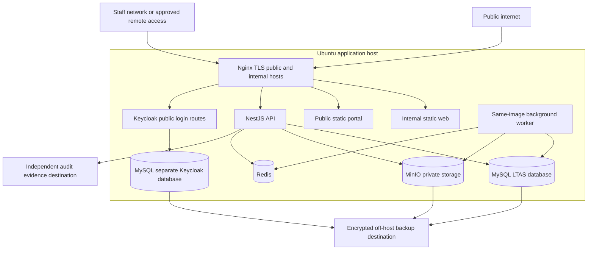

# 16 — Planned deployment architecture

Phase 1 provides a local Compose skeleton and an Nginx example. No production images have been released. Target Ubuntu Server, Docker, Docker Compose and Nginx. Start with a manageable single-host deployment if approved availability/risk permits; it is a single failure domain, not high availability.

Only Keycloak and dedicated backup/maintenance identities access its database. The LTAS API uses Keycloak's identity protocol endpoints, not its tables.

## Connection and routing policy

Nginx terminates TLS and routes by explicit host. The public host forwards only static portal assets and `/api/public/v1` (plus public health if approved). Internal API routes are not forwarded on the public host. The internal host serves authenticated web and `/api/v1`; remote staff access method is D-05. Keycloak login/protocol routes may be reachable as required, while its admin console is restricted. MySQL, Redis, MinIO administrative interfaces and container control sockets are not internet-exposed.

LTAS API/worker connect only to the LTAS database with service-specific grants. Keycloak alone owns its separate database/schema. A shared MySQL server is an operational simplification subject to compatibility/resource testing, with independent accounts, backups and upgrade ownership. No Prisma migration targets the Keycloak schema. MinIO and Redis use private container networks and credentials; firewall rules restrict host exposure.

## Environments and release process

Development, staging and production have separate databases, buckets, clients, secrets and hostnames. Use synthetic/anonymized test data; production dumps are not copied into developer workstations by default. Staging should approximate production topology and restore procedures. Pin tested supported image/runtime versions and retain exact build/source revision and dependency manifest. Supported versions and licensing are TBD; no floating `latest` for production.

Future CI checks lint/type/tests/contracts/dependency scan and builds immutable images. Authorized release deploys reviewed images, checks backup status, applies reviewed backward-compatible migrations, verifies health and smoke tests, then observes error/queue/storage metrics. Rollback uses a previous compatible image; irreversible data migrations require restore/forward-fix planning, never a blind down migration. All production changes are auditable.

## Operations

Monitor readiness separately from liveness; readiness indicates ability to serve the relevant command, not merely a running process. Watch disk and inode use, database growth/slow queries, object integrity, outbox lag, failed notifications, scanner health, TLS expiry, backup verification and audit-export lag. Configure bounded job concurrency, restart/backoff and log rotation. Time synchronization supports reliable recorded timestamps.

Store secrets through restricted mounted files or an approved secret manager, never committed Compose values. Nonsecret environment catalogs document purposes and defaults. Containers run with minimal privileges and resource limits; no application mount of the Docker socket. Administrative access uses named accounts and secured remote access with emergency procedures.

Hosting location, hardware, network resilience, power protection, monitoring provider, support/on-call hours and email transport remain TBD. A second application host/replication is future only if approved RTO/availability demands it. Off-server recovery evidence is mandatory even for a single host. See [backup](17-BACKUP-AND-DISASTER-RECOVERY.md) and [risks](22-RISK-REGISTER.md).
